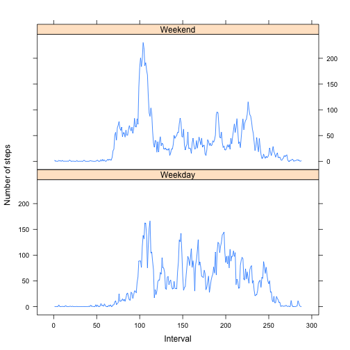

Reproducible Research
Peer Assessment 1
=======================================

### Part 0: Loading and preprocessing the data.

```r
setwd("/Users/zhuzhehan/Documents/Coursera/Reproducible Research/Data")
data <- read.csv("activity.csv", header = TRUE, sep = ",")
```

### Part 1: What is mean total number of steps taken per day?

```r
## Omit NA
data.temp1 <- na.omit(data)
## Calculate total number of steps per day
steps.daily <- tapply(X = data.temp1$steps, INDEX = data.temp1$date, FUN = sum)
## Daily steps histogram
hist(steps.daily, main = "Histogram of total number of steps taken each day", xlab = "")
```

 

```r
## mean of total number of steps per day
steps.mean.daily <- mean(steps.daily, na.rm = TRUE)
## median of total number of steps per day
steps.median.daily <- median(steps.daily, na.rm = TRUE)
```

The mean of total number of steps per day is 1.0766189 &times; 10<sup>4</sup>.  
The median of total number of steps per day is 10765. 

### Part 2: What is the average daily activity pattern?

```r
## There are 12*24=288 five-minute-interval per day and 61 days in total.
time.interval <- rep(c(1:288), 61)
## Calculate mean steps by five-minute-interval
## Missing values are omited in this part
steps.interval <- tapply(X = data$steps, INDEX = time.interval, FUN = mean, na.rm = TRUE)
## Time series plot
plot(x = 1:288, y = steps.interval, main = "Average Number of Steps taken per 5-minute interval", 
     xlab = "Time interval", ylab = "Ave Num of Steps", type = "l")
```

 

```r
## Find the five-minute-interval with the maximum number of steps
steps.interval.max.ind <- which.max(steps.interval)
```

The 104th 5-minute interval on average across all the days in the dataset, contains the maximum number of steps.

### Part 3: Imputing missing values

```r
## Calculate the total number of missing values in the dataset
num.na <- sum(is.na(data))
```

The total number of missing values in the dataset is 2304.

Create a new dataset called "data.new" with the strategy: use the mean for that 5-minute interval to fill in all the missing values in the dataset.

```r
data.new <- cbind(data, time.interval)
for (i in 1:dim(data.new)[1]){
  if (is.na(data.new[i,1])){
    data.new[i,1] = steps.interval[data.new[i,4]]
  }
}
```

Do the same thing as in Part 1 with the new dataset.

```r
## Calculate total number of steps per day
steps.daily.new <- tapply(X = data.new$steps, INDEX = data.new$date, FUN = sum)
## Daily steps histogram
hist(steps.daily.new, main = "Histogram of total number of steps taken each day", xlab = "")
```

 

```r
## mean of total number of steps per day
steps.mean.daily.new <- mean(steps.daily.new)
## median of total number of steps per day
steps.median.daily.new <- median(steps.daily.new)
```

The mean of total number of steps per day is 1.0766189 &times; 10<sup>4</sup>.  
The median of total number of steps per day is 1.0766189 &times; 10<sup>4</sup>.  
By comparison, the mean and median of total number of steps taken each day with the new dataset do not differ from that got in the first part of the assignment. There is almost no impact of imputing missing data on the estimates of the total daily number of steps.

### Part 4: Are there differences in activity patterns between weekdays and weekends?

```r
## Create a new factor with levels weekdays
weekday.fac <- weekdays(as.Date(data.new$date))
for (i in 1:length(weekday.fac)){
  if (weekday.fac[i] == "Saturday" | weekday.fac[i] =="Sunday"){
    weekday.fac[i] = c("Weekday")
  }
  else{
    weekday.fac[i] = c("Weekend")
  }
}
## Calculate mean steps by five-minute-interval
steps.interval.weekday <- tapply(X = data.new$steps[weekday.fac == "Weekday"], 
                                 INDEX = time.interval[weekday.fac == "Weekday"], FUN = mean)
steps.interval.weekend <- tapply(X = data.new$steps[weekday.fac == "Weekend"], 
                                 INDEX = time.interval[weekday.fac == "Weekend"], FUN = mean)
## Combine the above results and create a new factor with levels "Weekend" and "Weekday"
steps.interval.cmb <- cbind(steps.interval.weekend, steps.interval.weekday)
dim(steps.interval.cmb) = c(576, 1)
weekday.label <- rep(c("Weekend", "Weekday"), each = 288)
## Panel plot
library(lattice)
xyplot(steps.interval.cmb ~ rep(c(1:288), 2)|weekday.label, type = "l", 
       ylab="Number of steps", xlab="Interval", layout = c(1,2))
```

 

From the plot above, we can find that there are differences in activity patterns between weekdays and weekends.
